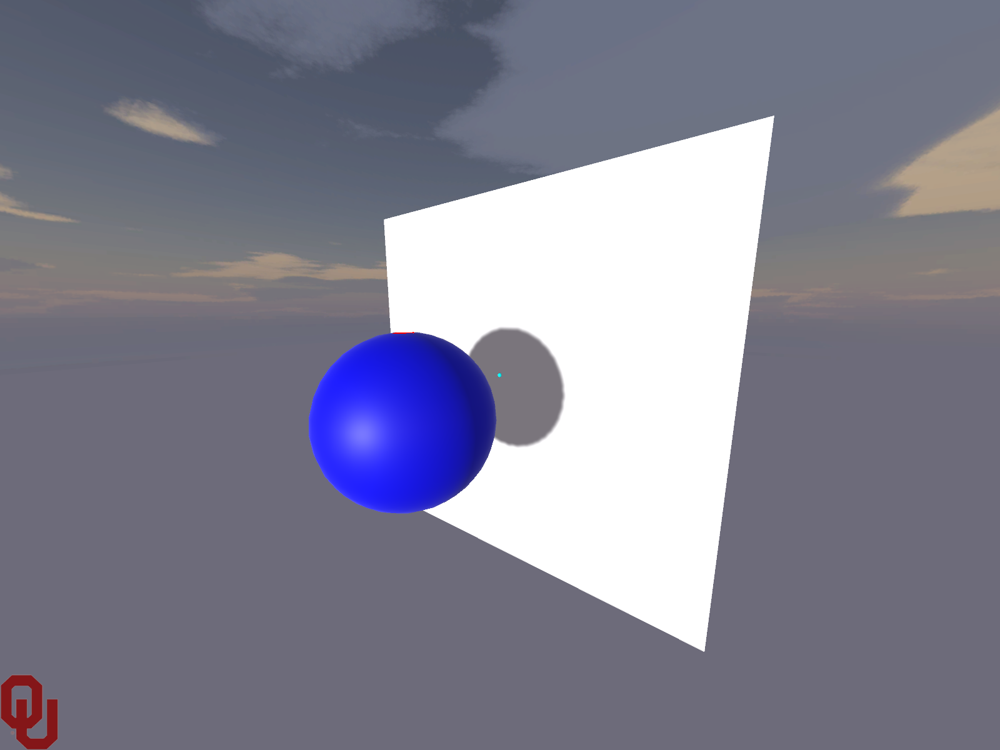
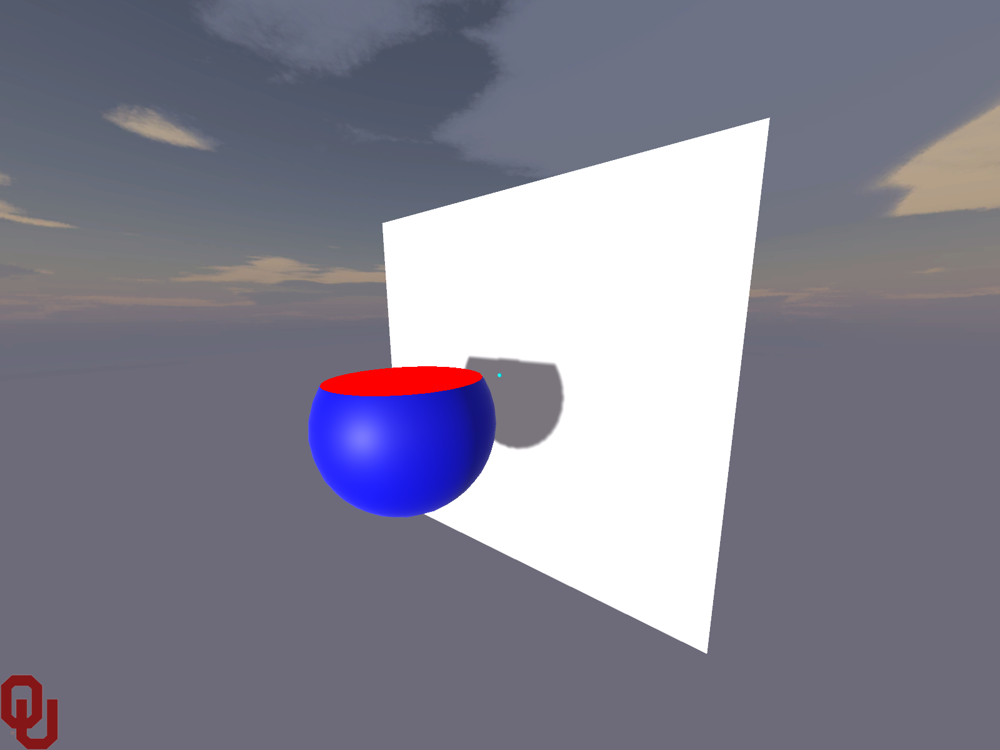
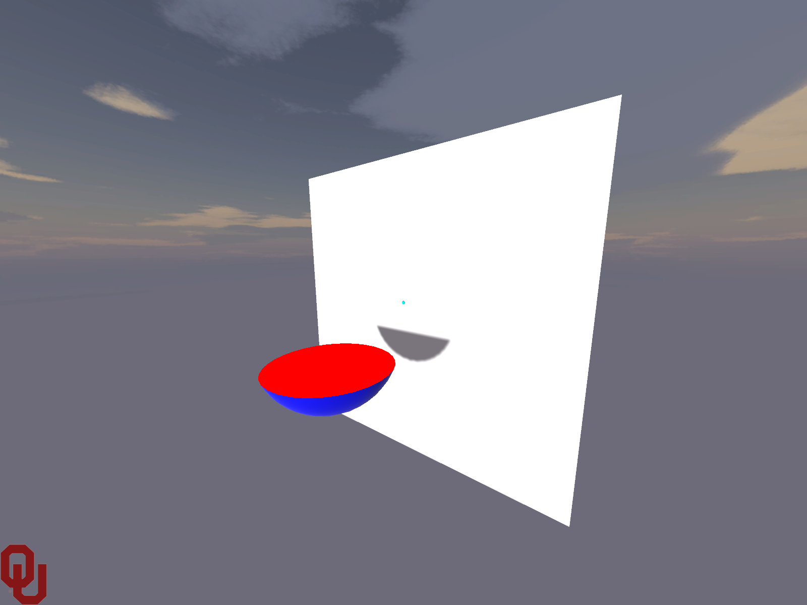

# Recognise.py

_A simple Unity surface shader to implement clipping planes for cross sections_

## Requirements

* A recent version of Unity (2017 and later?) and a GPU that support shader model 3.0

## Example usage

1. Place the shader file (`ClippingPlaneshader.shader`) into an appropriate subdirectory of Assets in your Unity project.
2. Drag the `ClippingPlaneshaderTest.cs` file onto an empty GameObject.
3. Set the `Cross Section Color` option of the clipping plane script we just applied to the GameObject (if desired). 
3. Run the scene.

You should see a blue sphere with a clipping plane moving up and down through it; the cross sectional area exposed by the clipping plane should be shown in the specified color (see Figs. 1 to 3 below, cross sectional area shown in red).

